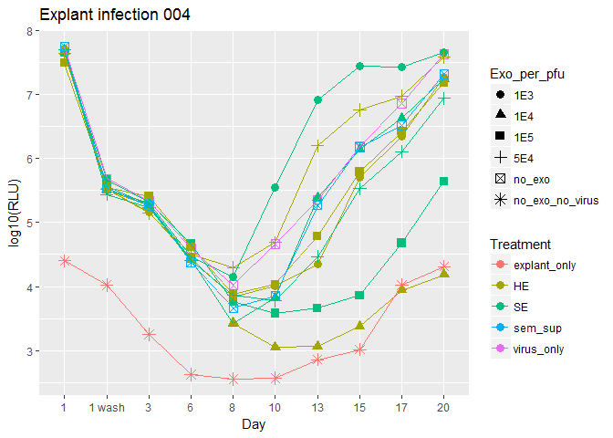
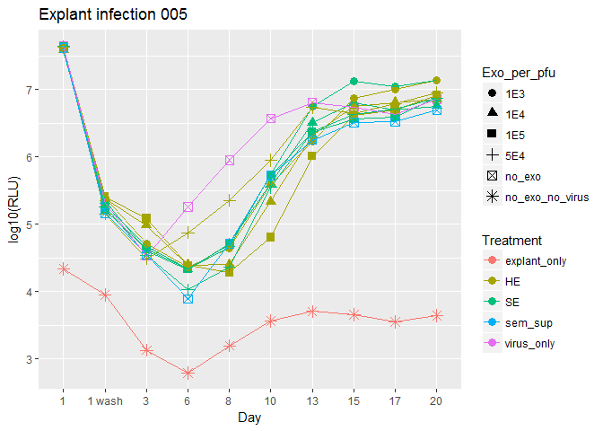

Explant infection experiments
================

Explant infection overview:

Explants are infected at 2E6 pfu/ml and then washed after 20-24hr. After washing, media is replaced with media containing 0.6ug/ml PHA. PHA-containing media is replaced with plain media after ~24hr.

Luciferase levels in collected supernatent are assesed with the Promega nano-glo kit.

Explant Infection 001:
======================

Pre-incubate virus (vNL\_sNLuc.6ATRi.B.Bal.ecto) with exosomes before adding to explants:

-   Concentrations: 1E5 and 1E4 exosomes per pfu

-   Exosomes used: SE and HE

We also included explant only and virus only controls.

``` r
knitr::opts_chunk$set(echo = FALSE, warning = FALSE, message = FALSE)

library(plyr)
library(dplyr)
```

    ## 
    ## Attaching package: 'dplyr'

    ## The following objects are masked from 'package:plyr':
    ## 
    ##     arrange, count, desc, failwith, id, mutate, rename, summarise,
    ##     summarize

    ## The following objects are masked from 'package:stats':
    ## 
    ##     filter, lag

    ## The following objects are masked from 'package:base':
    ## 
    ##     intersect, setdiff, setequal, union

``` r
library(plater)
library(ggplot2)
library(stringr)

options(scipen = 999)

explant_infection_001<-read_plate("../Explant_infection_001/20Sept16_infection001_layout_and_data.csv")


explant_infection_001<-explant_infection_001%>%
  mutate(Day = str_trim(Day, side = "both"))

#function for ordering day factors nicely:
orderDays<- function(exp_df){
  factor(exp_df$Day, levels = c("1","1 wash","3","6","8","10","13","15","17","20"))
}

explant_infection_001$Day<-orderDays(explant_infection_001)

#Map the exo per pfu values so they will match the later experiments

explant_infection_001$Exo_per_pfu <- mapvalues(explant_infection_001$Exo_per_pfu, from = c("1.0E+04","1.0E+05"), to = c("1E4","1E5"))


ggplot(explant_infection_001, aes(x = Day, y = log10(RLU)))+
  geom_point(aes(color = Treatment,shape = Exo_per_pfu),size = 3)+
  geom_line(aes(group = interaction(Treatment, Exo_per_pfu),color = Treatment))+
ggtitle("Explant infection 001")
```


Explant infection 002
=====================

-   Same conditions as 001


Explant Infection 003:
======================

-   Concentrations: 1E5 and 1E4 exosomes per pfu, 1:50 seminal sup.

-   Exosomes used: SE and HE

This was a two part experiment:

Pre-incubate virus (vNL\_sNLuc.6ATRi.B.Bal.ecto) with exosomes OR seminal sup before adding to explants:

-   Controls = explants only and explants with virus that was incubated alone at 37C for ~1hr (like the virus + exos)

Pre-incubate explants with exosomes OR seminal sup before virus is added.

-   Controls = explants only and explants infected with virus that was kept in the fridge for ~1hr.

PROTOCOL DEVIATIONS:

-   I forgot to remove the PHA-containing media on day 2, so it wasn't replaced with new media until day 3.

-   There were 4 explants in the "pre-incubate explants with 1E5 HE" condition.

*Reminder*: In the plot below,"virus only" means that the explants were infected with virus that had been incubating (with no exos) for 1hr at 37C.


*Reminder*: In the plot below, "virus only" means that the explants were infected with virus that had been in the fridge (with no exos) for 1hr.


Explant Infection 004:
======================

-   Concentrations: 1E5,1E4, 1E3 and 5E4 exosomes per pfu, 1:50 seminal sup.

-   Exosomes used: SE and HE

-   Only did virus (vNL\_sNLuc.6ATRi.B.Bal.ecto) and exosome/sup preincubation (no exos + explant preinc)



Explant Infection 005:
======================

-   Concentrations: 1E5,1E4, 1E3 and 5E4 exosomes per pfu, 1:50 seminal sup.

-   Exosomes used: SE and HE

-   Only did virus (vNL\_sNLuc.6ATRi.B.Bal.ecto) and exosome/sup preincubation (no exos + explant preinc)

PROTOCOL DEVIATIONS:

-   During virus wash off I skipped a well so conditions 8-11 were off by one on the spin plate. I abandoned those pellets since they got mixed up and started using a new set of wells for the washes for those conditions.



Explant Infection 006:
======================

-   Concentrations: 1E5,1E4, 1E3 and 5E4 exosomes per pfu, 1:50 seminal sup.

-   Exosomes used: SE and HE

-   Only did virus (vNL\_sNLuc.6ATRi.B.Bal.ecto) and exosome/sup preincubation (no exos + explant preinc)

-   Did 2 reps for each condition

PROTOCOL DEVIATIONS:

-   Did not collect sups for conditions 1, 5, 9, 2, 6 and 10 on day 10 (by mistake) but did replace media.

First check how the replicates look 


Compilations of results from multiple experiments (not including 006) arranged in a variety of ways:


