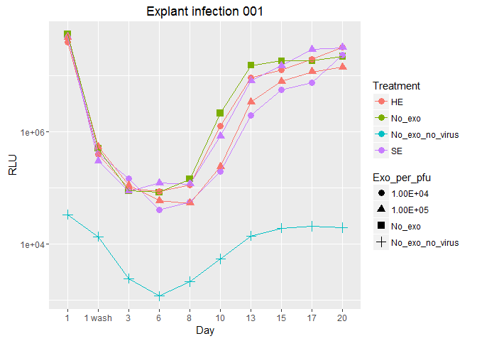
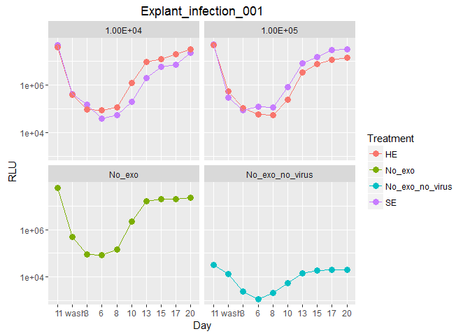

Explant infection experiments
================

Explant infection 001 had the following conditions:

1.  Pre-incubate 10^4 SE + virus together, then add to explants

2.  Virus only

3.  Explants only

4.  Pre-incubate 10^4 Hela exos + virus together, then add

5.  Pre-incubate 10^5 SE + virus together, then add to explants

6.  pre-inc 10^5 Hela exos + virus

The virus concentration was 2E6 pfu/ml

Another way of looking at it:

