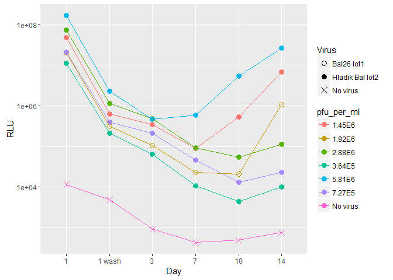

Explant Titrations
------------------

### Goal

Titrate lot1 of vNL\_sNLuc\_6ATRi.B.Bal.ecto based on the kinetics of RA and KW's virus; "Bal26 lot1", at the concentration that they use for infection experiments (dilution factor of 17.91, I think...)

Titration 001
-------------

This is a plot of luciferase production over days 1 - 14 for multiple conditions. The "Hladik Bal lot1" virus is vNL\_sNLuc\_6ATRi.B.Bal.ecto made by Greg Mize

-   The conditions are in the format virus type:dilution factor.

-   Day 1 supernatent still contains input virus. 1 wash is still day 1 but after the explants have been washed to remove input virus.

-   Hladik Bal26 lot1 with a dilution factors of 34.38 or 17.19 look closest to RA/KW's virus.

This is a plot of the luciferase over time from day1- 21 but we included fewer conditions based on the results from the first run of d1-14 with all conditions.

-   Hladik Bal26 lot1 with a dilution factor of 17.19 looks closest to Bal26 lot1.

Titration 002
-------------

Lucia set up a second titration experiment on 14June16.

-   Hladik Bal with a dilution factor of 25 matches the kinetics of Bal26 lot1, but I'm not sure why they are so different from all the other conditions.

Conclusions
-----------

-   Based on three nanoluc assays from two different titrations, the dilution factors for Hladik Bal lot1 virus that resulted in kinetics that were closest to Bal26 lot1 were a range between ~9 to 25.

Caveats
-------

-   The "No virus" control was kind of high for the second titration.

-   The Bal26 lot1 and Hladik Bal lot1 lines, both with dilution factor of 17.91 were very low compared to all the other dilutions
