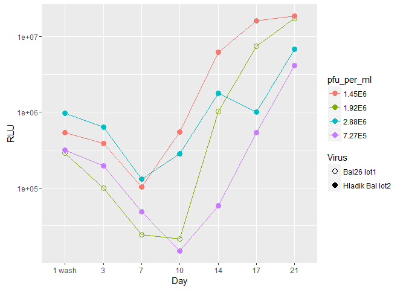

Titration 001
-------------

This is a plot of luciferase production over days 1 - 14 for multiple conditions. The conditions are in the format virus type:dilution factor. Day 1 supernatent still contains input virus. 1 wash is still day 1 but after the explants have been washed to remove input virus. It looks like our virus with a dilution factors of 34.38 or 17.19 look closest to RA/KW's virus.

The "Hladik Bal lot1" virus is vNL\_sNLuc\_6ATRi.B.Bal.ecto made by Greg Mize

This is a plot of the luciferase over time from day1- 21 but we included fewer conditions based on the results from the first run of d1-14 with all conditions. Our virus with a dilution factor of 17.19 looks closest.

Titration 002
-------------

Lucia set up a second titration experiment on 14June16 with the following results:

