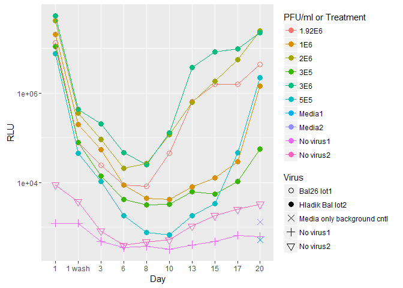

Explant titrations
================

### Goal

Titrate lot2 of vNL\_sNLuc\_6ATRi.B.Bal.ecto based on the kinetics of RA and KW's virus; "Bal26 lot1", at the concentration that they use for infection experiments (1.92E6 pfu/ml)

Titration 001
-------------

This is a plot of luciferase production over days 1 - 14 for multiple conditions. The "Hladik Bal lot2" virus is vNL\_sNLuc\_6ATRi.B.Bal.ecto lot2 made by Greg Mize.

-   Day 1 supernatent still contains input virus. 1 wash is still day 1 but after the explants have been washed to remove input virus.

-   Hladik Bal26 lot2 with pfu/ml of 3.64E5 or 7.27E5 (dil. factors 68.76, 34.38) look closest to RA/KW's virus.

--------------------------------------------------------------------------

This is a plot of the luciferase over time from day1- 21 but we included fewer conditions based on the results from the first run of d1-14 with all conditions.

-   Hladik Bal26 lot2 with a pfu/ml of 7.27E5 (dil. factor of 34.38) looks closest to Bal26 lot1.

Titration 002
-------------

Lucia set up a second titration experiment on 14June16.

-   Hladik Bal with a dilution factor of 5.4E5 (dil. factor 46.3) matches the kinetics of Bal26 lot1.

Titration 003
-------------

On 12July I started third titration testing four different concentrations of pfu/ml : 3E5, 5E5, 1E6,2E6 and 3E6. I also included two "No virus" conditions; one well that was separated from the others by a whole column of wells and another that was in the same column as the other conditions.

Summary
-------

Here is a plot of just Bal26 lot 1 kinetics in the different experiments. Note that I ran sups from the first titration twice; one up to day14 and once for all the days.

Here are the Bal26 lot 1 kinetics next to the concentration of Hladik Bal lot2 that matched most closely. I am only showing the results from titration001 sups from all days.

-   Bal26 lot1 is always at 1.92E6 PFU/ml

